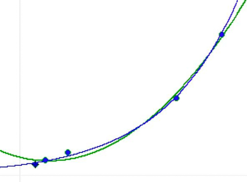
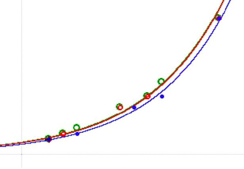

# NC_tab_astro02.md

>"As the eyes, said I, seem formed for studying astronomy, so do the ears seem formed for harmonious motions: and these seem to be twin sciences to one another, as also the Pythagoreans say; and we too [...] agree with them [...]", (Book VII, chap. XII of Plato's Republic, the Allegory of the Cave, Davis et al., [1901](), p. 252).

Table 1. Distances of Solar System objects from the Sun in semimajor axis $10^3 km$ and Galactical objects¹ from the core in approx. light years $ly$, $10^{12} km$, with ratios in comparison.
~~~
Solar System		Galaxy*								
dist. from		dist. from		ly					
Sun	10³km		Core	M	NGC	min	max	AM		10¹²km		ratio	1/ratio

Venus	 108 210 	LSSC	24				 16 439 	155 520 	1,44	0,70
Earth	 149 598 	Sun			25 881 26 996 	 26 439 	250 127 	1,67	0,60
Mars	 227 956 	SagDEG	54	6715			 50 000 	473 035 	2,08	0,48
Jupiter	 778 479 	LMC					 163 000 	1 542 094 	1,98	0,50
Saturn	 1 432 041 	SMC		292			 210 000 	1 986 747 	1,39	0,72

AM	 539 257 						 93 175 	881 505 	1,71	0,60
SD	 507 707 						 78 396 	741 684 	0,28	0,10
~~~
¹) Small Sagittarius Star Cloud (LSSC, M24, IC4615), Sagittarius Dwarf Spheroidal Galaxy (SagDEG, M54, NGC6715), Large Magellanic Cloud (LMC), Small Magellanic Cloud (SMC, NGC292).

Table 2. Regr. *gal* ($ly$, $10^{12}km$) with *solsyst* ($10^3km$), $n=5$.
~~~
		log		exp		quad	
gal		y=gal		y=solsys	y=gal		y=solsys

ly	a	78777,790	1,255E-05	-1,118E-07	3,899E-05
	b	-908628,398	103493,582	0,319		-2,371
	c	-		-		-17482,841	182019,183

10¹²km	a	745292,906	1,327E-06	-1,057E-06	4,356E-07
	b	-8596258,952	103493,550	3,017		-0,251
	c	-		-		-165399,557	182019,197

	r	0,994		0,994		-		-
	r²	0,989		0,989		1,000		0,992
	det%	98,88|		98,88|		99,99		99,21
~~~

Table 3. Predicted distance values ($y'$, $ly$, $10^{12}km$, $10^3km$) ​​by regression type (logarithmic, $y=a\cdot\log(x)+b$; exponential $y=b\cdot e^{a\cdot x}$; quadratic, $y=a\cdot x^2+b\cdot x+c$).
~~~
						y', reg				diff				ratio	
		x=solsys	y=gal		log		quad		log		quad		log		quad

ly	 	108 210 	16 439 	 	4 550,27 	15 716,48 	-11888,23	-722,02		0,277		0,956
	 	149 598 	26 439 	 	30 064,66 	27 722,51 	3626,16		1284,01		1,137		1,049
	 	227 956 	50 000 	 	63 245,94 	49 404,28 	13245,94	-595,72		1,265		0,988
	 	778 479 	163 000 	159 999,98 	163 040,50 	-3000,02	40,50		0,982		1,000
	 	1 432 041 	210 000 	208 016,15 	209 993,24 	-1983,85	-6,76		0,991		1,000
	AM													0,930		0,999|
	SD													0,343		0,030

		x=gal		y=solsys	exp		quad		exp		quad		exp		quad

	 	16 439 	 	108 210 	127 211,441 	 153 578,59 	19001,44	45368,59	1,176		1,419
	 	26 439 	 	149 598 	144 224,858 	 146 586,39 	-5373,14	-3011,61	0,964		0,980
	 	50 000 	 	227 956 	193 857,746 	 160 945,33 	-34098,25	-67010,67	0,850		0,706
	 	163 000 	778 479 	800 738,626 	 831 519,65 	22259,63	53040,65	1,029		1,068
	 	210 000 	1 432 041 	1 444 462,718 	 1 403 654,04 	12421,72	-28386,96	1,009		0,980
	AM													1,005|		1,031
	SD													0,105		0,229

		x=solsys	y=gal		log		quad		log		quad		log		quad

10¹²km	 	108 210 	155 520 	43 049,01 	 148 689,12 	-112470,71	-6830,60	0,277		0,956
	 	149 598 	250 127 	284 432,92 	 262 274,52 	34306,20	12147,81	1,137		1,049
	 	227 956 	473 035 	598 350,99 	 467 399,22 	125315,99	-5635,78	1,265		0,988
	 	778 479 	1 542 094 	1 513 711,82 	 1 542 477,12 	-28382,28	383,02		0,982		1,000
	 	1 432 041 	1 986 747 	1 967 978,26 	 1 986 683,03 	-18768,74	-63,97		0,991		1,000
	AM													0,930		0,999|
	SD													0,343		0,030

		x=gal		y=solsys	exp		quad		exp		quad		exp		quad

	 	155 520 	108 210 	127 211,406 	 153 578,61 	19001,41	45368,61	1,176		1,419
	 	250 127 	149 598 	144 224,821 	 146 586,41 	-5373,18	-3011,59	0,964		0,980
	 	473 035 	227 956 	193 857,706 	 160 945,36 	-34098,29	-67010,64	0,850		0,706
	 	1 542 094 	778 479 	800 738,636 	 831 519,70 	22259,64	53040,70	1,029		1,068
	 	1 986 747 	1 432 041 	1 444 462,867 	 1 403 654,08 	12421,87	-28386,92	1,009		0,980
	AM													1,005|		1,031
	SD													0,105		0,229
~~~

Figure 1. The distances of Solar System objects $y$ are $98.88\\%$ exponentially predictable from the distances of the Galactical objects $x$, $solsyst=y=103493,58\cdot e^{0,00001\cdot x}$.

>" [...] Sed Pythagoras interdum ex musica r[ati]one appellat Tonum [...] Ita. vii. Tonos effici. qua[m] Diapason harmoniam uocant. hoc est uniuersitatem co[n]centus [...] ", (Plinius Secundus, [1250](), fol. 22r).

>"XX. But occasionally Pythagoras draws on the Tone theory of music [...] the seven tones thus producing the so-called diapason, i.e. a universal harmony […] ", (Rackham, [1967](), p. 227 ff.).

Table 4. Distance values for tone (cum, rounded), Saturn moons IV-VIII and Jupiter moons II,IV ($10^3km$).
~~~
			tone							
dist			step	cum	int	Moon		Sat	Jup	dist 10³km

terram ad lunam		1,0	1,0	1	Dione		IV		377,40
luna ad mercurium	0,5	1,5	2	Rhea		V		527,04
ad venerem		0,5	2,0	2	Europa			II	671,1
ad solem		1,5	3,5	4	Titan		VI		1221,87
ad martem		1,0	4,5	5	Hyperion	VII		1500,93
ad iovem		0,5	5,0	5	Callisto		IV	1882,7
ad saturnum		0,5	5,5	6					
ad signiferum		1,5	7,0	7	Iapetus		VIII		3560,85
~~~

Table 5. Regression coefficients (a-e), correlation $r$ and determination coefficient $det\\%$ for linear- ($y=a\cdot x+b$), exponential- ($y=b\cdot e^{a\cdot x}$), cubic- ($y=a\cdot x^3+b\cdot x^2+c\cdot x+d$) and quartic regression ($y=a\cdot x^4+b\cdot x^3+c\cdot x^2+d\cdot x+e$) of (1) Saturn moons IV-VIII ($y$, $10^3km$) by tone_a and tone_b ($x$, $n=5$) and (2) Saturn moons IV-VIII and Jupiter moons II,IV ($y$, $10^3km$) by tone_c ($x$, $n=7$).
~~~
Tone		lin		exp		cub		quart

tone_a	a	501,527		0,372		18,241		12,799
	b	-468,185	256,710		-125,274	-175,767
	c	-		-		495,935		848,323
	d	-		-		-40,372		-1356,949
	e	-		-		-		1048,993

	r	0,938		0,998		-		-
	r²	0,881		0,995		0,996		1,000
	det%	88,068		99,510|		99,591		100,000

tone_b	a	509,205		0,365		21,055		7,410
	b	-344,601	294,110		-184,171	-89,818
	c	-		-		808,159		367,348
	d	-		-		-296,293	-252,665
	e	-		-		-		345,124

	r	0,967		0,994		-		-
	r²	0,936		0,987		0,999		1,000
	det%	93,572		98,734|		99,914		100,000

tone_c	a	492,276		0,361		13,523		1,597
	b	-331,267	303,109		-94,615		-10,845
	c	-		-		518,878		29,254
	d	-		-		-73,814		276,800
	e	-		-		-		75,973

	r	0,965		0,994		-		-
	r²	0,932		0,987		0,998		0,999
	det%	93,171		98,713|		99,842		99,850
~~~

Table 6. Predicted distance values ($y'$, $10^3km$) ​​by regression type (linear, $y=a\cdot x+b$; exponential, $y=b\cdot e^{a\cdot x}$; cubic, $y=a\cdot x^3+b\cdot x^2+c\cdot x+d$; quartic, $y=a\cdot x^4+b\cdot x^3+c\cdot x^2+d\cdot x+e$) to tone (a, b, c) $x$.
~~~
				y', reg					diff					ratio			
Tone	x	y=dist		lin	exp	cub	quart		lin	exp	cub	quart		lin	exp	cub	quart

tone_a	1	377,40		33,34	372,39	348,53	377,39		-344,06	-5,01	-28,87	-0,01		0,088	0,987	0,924	1,000
	2	527,04		534,87	540,20	596,33	527,01		7,83	13,16	69,29	-0,03		1,015	1,025	1,131	1,000
	4	1221,87		1537,92	1136,77	1106,41	1221,83		316,05	-85,10	-115,46	-0,04		1,259	0,930	0,906	1,000
	5	1500,93		2039,45	1649,04	1587,58	1500,99		538,52	148,11	86,65	0,06		1,359	1,099	1,058	1,000
	7	3560,85		3042,50	3470,13	3549,41	3561,71		-518,35	-90,72	-11,44	0,86		0,854	0,975	0,997	1,000
	AM													0,915	1,003|	1,003	1,000
	SD													0,450	0,057	0,084	0,000

tone_b	1	377,40		164,60	423,67	348,75	377,40		-212,80	46,27	-28,65	0,00		0,436	1,123	0,924	1,000
	1,5	527,04		419,21	508,49	572,62	527,04		-107,83	-18,55	45,58	0,00		0,795	0,965	1,086	1,000
	3,5	1221,87		1437,62	1055,17	1178,90	1221,83		215,75	-166,70	-42,97	-0,04		1,177	0,864	0,965	1,000
	4,5	1500,93		1946,82	1519,98	1529,60	1500,83		445,89	19,05	28,67	-0,10		1,297	1,013	1,019	1,000
	7	3560,85		3219,83	3785,58	3558,31	3560,36		-341,02	224,73	-2,54	-0,49		0,904	1,063	0,999	1,000
	AM													0,922	1,005|	0,999	1,000
	SD													0,303	0,088	0,054	0,000

tone_c	1	377,40		161,01	435,02	363,97	372,78		-216,39	57,62	-13,43	-4,62		0,427	1,153	0,964	0,988
	1,5	527,04		407,15	521,15	537,26	528,48		-119,89	-5,89	10,22	1,44		0,773	0,989	1,019	1,003
	2	671,1		653,28	624,34	693,67	685,38		-17,82	-46,76	22,57	14,28		0,973	0,930	1,034	1,021
	3,5	1221,87		1391,70	1073,46	1163,05	1177,80		169,83	-148,41	-58,82	-44,07		1,139	0,879	0,952	0,964
	4,5	1500,93		1883,97	1540,62	1577,52	1580,59		383,04	39,69	76,59	79,66		1,255	1,026	1,051	1,053
	5	1882,7		2130,11	1845,66	1845,65	1833,82		247,41	-37,04	-37,05	-48,88		1,131	0,980	0,980	0,974
	7	3560,85		3114,66	3801,66	3560,78	3561,58		-446,19	240,81	-0,07	0,73		0,875	1,068	1,000	1,000
	AM													0,939	1,004|	1,000	1,000
	SD													0,260	0,083	0,034	0,028
~~~

Figure 2. The distances of (1) Saturn moons IV-VIII  $y$ are $99.51\\%$ and $98.73\\%$ exponentially predictable from the tones $x$ and the distances of Saturn moons IV-VIII and (2) Jupiter moons II,IV $y$ are $98.71\\%$ exponentially predictable from the tones $x$.

## References

