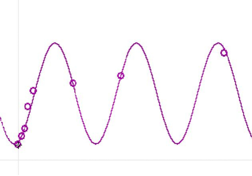

# NC_tab_astro03.md

Table 1. *Distance* values for *Solar System* objects in *tones* (s. Plinius Secundus [1250](https://gallica.bnf.fr/ark:/12148/btv1b550140045/); de Beauvais, [1264](https://digi.vatlib.it/view/MSS_Arch.Cap.S.Pietro.A.40)), and the models of Velho *VL* (Velho, [1568](http://catalogue.bnf.fr/ark:/12148/cb416166390)), Ptolemy *PT* (Goldstein, [1967](https://doi.org/10.2307/1006040)) and the actual model *AS* Williams, [2025](https://nssdc.gsfc.nasa.gov/planetary/planetfact.html)). 
~~~
				y=dist 10³km		
Object		x=tone		PT		VL		AS

Moon		1,0		306,144		344,093		384,400
Mercury		1,5		733,470		895,538		57909,000
Venus		2,0		3970,305	4974,750	108210,000
Earth		3,5		7717,380	6627,225	149598,000
Mars		4,5		32145,120	34430,550	227956,000
Jupiter		5,0		73372,551	65894,813	778479,000
Saturn		5,5		108591,830	104737,880	1432041,000
~~~

Table 2. Linear- ($y=a\cdot x+b$), exponential- ($y=b\cdot e^{a\cdot x}$), quadratic- ($y=a\cdot x^2+b\cdot x+c$) and cubic regression ($y=a\cdot x^3+b\cdot x^2+c\cdot x+d$) for *Solar System* dist. $y$ ($10^3km$) with *tone* $x$, $n=7$.
~~~
Reg		PT		VL		AS

lin	a	20578,34	19524,29	235268,41
	b	-35209,29	-33021,96	-379513,71

	r	0,87		0,87		0,80
	det%	75,24		75,70		64,70

exp	a	1,23		1,17		1,24
	b	137,49		174,01		1681,27

	r	0,98		0,97		0,83
	det%	96,27|		94,69|		68,84

quad	a	10487,75	9886,76		136737,33
	b	-47225,73	-44394,35	-648748,50
	c	45241,78	42818,94	669392,33

	r²	0,96		0,97		0,88
	det%	96,27		96,58		88,21

cub	a	3072,65		3008,57		68346,22
	b	-19848,82	-19817,21	-538052,56
	c	40738,54	41735,63	1307880,07
	d	-24223,14	-25197,45	-875746,97

	r²	0,99		1,00		0,98
	det%	99,34		99,86		98,18
~~~

Table 3. *Predicted distance* values ($y'$, $10^3km$) ​​by regression *type*.
~~~
				y' reg								diff								ratio			
	x=tone	y=dist		lin		exp		quad		cub		lin		exp		quad		cub		lin		exp		quad		cub

PT1,0	306,144		-14630,95	470,00		8503,79		-260,78		-14937,09	163,86		8197,65		-566,93		-47,791		1,535		27,777		-1,852
	1,5	733,470		-4341,78	869,00		-1999,38	2594,99		-5075,25	135,53		-2732,85	1861,52		-5,920		1,185		-2,726		2,538
	2,0	3970,305	5947,39		1606,70		-7258,69	2439,81		1977,09		-2363,61	-11228,99	-1530,50	1,498		0,405		-1,828		-0,385
	3,5	7717,380	36814,90	10155,13	8426,65		6953,34		29097,52	2437,75		709,27		-764,04		4,770		1,316		1,092		-0,099
	4,5	32145,120	57393,24	34715,20	45102,91	37156,44	25248,12	2570,08		12957,79	5011,32		1,785		1,080		1,403		0,156
	5,0	73372,551	67682,41	64185,46	71306,85	67329,67	-5690,14	-9187,09	-2065,70	-6042,88	0,922		0,875		0,972		-0,082
	5,5	108591,830	77971,58	118673,49	102754,67	110623,32	-30620,25	10081,66	-5837,16	2031,49		0,718		1,093		0,946		0,019
AM																				-6,288		1,070|		3,948		0,042
SD																				17,204		0,332		9,843		1,198

VL	1,0	344,093		-13497,68	537,35		8311,36		-270,46		-13841,77	193,26		7967,26		-614,55		-39,227		1,562		24,154		-1,786
	1,5	895,538		-3735,53	1008,18		-1527,37	2971,20		-4631,07	112,64		-2422,91	2075,67		-4,171		1,126		-1,706		2,318
	2,0	4974,750	6026,61		1810,74		-6422,71	3073,55		1051,86		-3164,01	-11397,46	-1901,20	1,211		0,364		-1,291		-0,382
	3,5	6627,225	35313,04	10491,01	8551,54		7108,96		28685,81	3863,79		1924,32		481,74		5,328		1,583		1,290		0,073
	4,5	34430,550	54837,32	33842,11	43251,28	35470,52	20406,77	-588,44		8820,73		1039,97		1,593		0,983		1,256		0,030
	5,0	65894,813	64599,47	60782,34	68016,22	64121,97	-1295,35	-5112,47	2121,40		-1772,85	0,980		0,922		1,032		-0,027
	5,5	104737,880	74361,61	109168,53	97724,53	105429,10	-30376,27	4430,65		-7013,35	691,22		0,710		1,042		0,933		0,007
AM																				-4,796		1,083|		3,667		0,033
SD																				14,288		0,385		8,444		1,115

AS	1,0	384,400		-144245,31	5807,64		157381,16	-37573,24	-144629,71	5423,24		156996,76	-37957,64	-375,248	15,108		409,420		-98,745
	1,5	57909,000	-26611,10	10793,94	3928,58		106123,37	-84520,10	-47115,06	-53980,42	48214,37	-0,460		0,186		0,068		0,833
	2,0	108210,000	91023,10	20061,38	-81155,34	134572,70	-17186,90	-88148,62	-189365,34	26362,70	0,841		0,185		-0,750		0,244
	3,5	149598,000	443925,72	128796,05	73804,90	41033,61	294327,72	-20801,95	-75793,10	-108564,39	2,967		0,861		0,493		-0,726
	4,5	227956,000	679194,13	444901,42	518955,06	342198,30	451238,13	216945,42	290999,06	114242,30	2,979		1,952		2,277		0,501
	5,0	778479,000	796828,33	826883,66	844083,14	755616,87	18349,33	48404,66	65604,14	-22862,13	1,024		1,062		1,084		-0,029
	5,5	1432041,000	914462,53	1536827,16	1237579,89	1412605,80	-517578,47	104786,16	-194461,11	-19435,20	0,639		1,073		0,864		-0,014
AM																				-52,465		2,918		59,065		-13,991
SD																				131,781		5,008		143,034		34,604
~~~

Table 4. 
~~~
			x=dist 10³km		
Object		y=tone	PT		VL		AS

Moon		1,0	306,144		344,093		384,400
Mercury		1,5	733,470		895,538		57909,000
Venus		2,0	3970,305	4974,750	108210,000
Earth		3,5	7717,380	6627,225	149598,000
Mars		4,5	32145,120	34430,550	227956,000
Jupiter		5,0	73372,551	65894,813	778479,000
Saturn		5,5	108591,830	104737,880	1432041,000
Uranus¹		7,0	127560,000	212 577,75	2867043,000
~~~
¹) PT, *stars of first magnitude*; VL, *firmamento*.

Table 5. *Trigonometric* regression coeff. of *Solar System* $x$ distances with *tone*.
~~~
Reg		PT		VL		AS

trig	a	n.		n.		3,32
	b					-5,56178E-06
	c					10,71
	d					4,38
~~~

Table 6. *Predicted distance* values ($y'$, $10^3km$) ​​from *trigonometric* regression.
~~~
			y' reg		
	x=dist	y=tone	trig	diff	ratio

AS	384,4	1,0	1,2	0,20	1,200
	57909	1,5	1,7	0,16	1,105
	108210	2,0	2,3	0,29	1,143
	149598	3,5	2,9	-0,57	0,837
	227956	4,5	4,3	-0,18	0,961
	778479	5,0	4,7	-0,30	0,940
	1432041	5,5	5,7	0,16	1,029
	2867043	7,0	7,2	0,25	1,036
AM					1,031|
SD					0,110
~~~

Figure 1. *Trigonometric* regression of actual *Solar System* $x$ distances with *tones*, where $tone=y=3,32\cdot \sin(-0.0000056\cdot x+10,71)+4,38$.

>"MAius quo scitur q[ue] terra s[ecundu]m sensum qua[n]tu[m] ad spaciu[m] q[uo]d peruenit a centro totius ad orbe[m] stellaru[m] fixaru[m] sit sicut punctum: est q[ue] magnitudines quantitatum stellaru[m]: [et] intervallor[um] que inter eas existunt: videntur in omnibus plagis celi vbicu[m]q[ue] terraru[m] in eadem bora equales [et] similes. que[m]admodum inuenimus considerationes que sunt in diuersis climatibus non diuersas neq[ue] in aliquo decipientes.", (Ptolemæus, [1515](https://doi.org/10.3931/e-rara-206), fol. 4r).

>" […] the earth has […] the ratio of a point to the distance of […] the fixed stars. A strong indication of this is the fact that the sizes and distances of the stars […] appear equal and the same from all parts of the earth everywhere, [...] ", (Toomer, [1984](https://doi.org/10.2307/631776), p. 43).

>„PUnctus est cuius p[ar]s no[n] est.“, (Ratdolt, [1482](https://catalog.lindahall.org/discovery/delivery/01LINDAHALL_INST:LHL/1286816310005961), fol. 2r). 

>A point is what has no part, *a dimensionless or virtual, only logically existing geometric object having no properties except location*.

## References

Goldstein, B. R. (1967). The Arabic Version of Ptolemy’s Planetary Hypotheses. *Transactions of the American Philosophical Society, 57*(4), 3-55. [https://doi.org/10.2307/1006040](https://doi.org/10.2307/1006040)

De Beauvais, V. (1264). *Speculi naturalis pars II*. Arch. Cap. S. Pietro. A. 40. Vatican: Biblioteca Apostolica Vaticana. [https://digi.vatlib.it/view/MSS_Arch.Cap.S.Pietro.A.40](https://digi.vatlib.it/view/MSS_Arch.Cap.S.Pietro.A.40)

Plinius Secundus, G. (1250). *Plinius Secundus Major, Historia Naturalis. Liber Trigesimus Septimus Manu Recentiore Suppletus Est*. Latin 6797. Paris: Bibliothèque nationale de France. [https://gallica.bnf.fr/ark:/12148/btv1b550140045/](https://gallica.bnf.fr/ark:/12148/btv1b550140045/)

Ptolemaeus, C. (1515). *Almagestum CL. Ptolemei Pheludiensis Alexandrini astronomorum principis: Opus ingens ac nobile omnes Caelorum motus continens.* Felicibus astris eat in lucem: Ductu Petri Liechtenstein Coloniensis Germani. Anno Virginei Partus, 1515, Die 10. Ia. Venetiis ex officina eiusdem litteraria. [https://doi.org/10.3931/e-rara-206](https://doi.org/10.3931/e-rara-206)

Ratdolt, E. (1482). *Euclides. Elementa geometriae. Edited by Campano da Novara*. Venice: Erhard Ratdolt. [https://catalog.lindahall.org/discovery/delivery/01LINDAHALL_INST:LHL/1286816310005961](https://catalog.lindahall.org/discovery/delivery/01LINDAHALL_INST:LHL/1286816310005961)

Toomer, G. J. (1984). *Ptolemy's Almagest*. Duckworth, London & Springer, New York. [https://doi.org/10.2307/631776](https://doi.org/10.2307/631776)

Velho, B. (1568). *Principio da verdadeira cosmographia ... per Bartholomeu Velho portugues/neste anno de 1568*. Paris: Bibliothèque nationale de France. [http://catalogue.bnf.fr/ark:/12148/cb416166390](http://catalogue.bnf.fr/ark:/12148/cb416166390)

Williams, D. R. (2025). *Planetary Fact Sheet*. NASA Goddard Space Flight Center.
[https://nssdc.gsfc.nasa.gov/planetary/factsheet/](https://nssdc.gsfc.nasa.gov/planetary/factsheet/)

